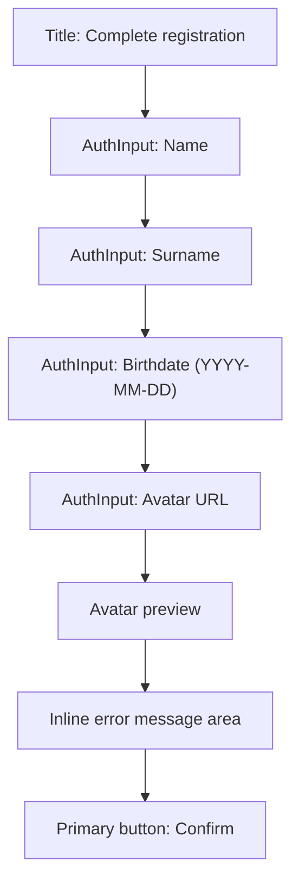
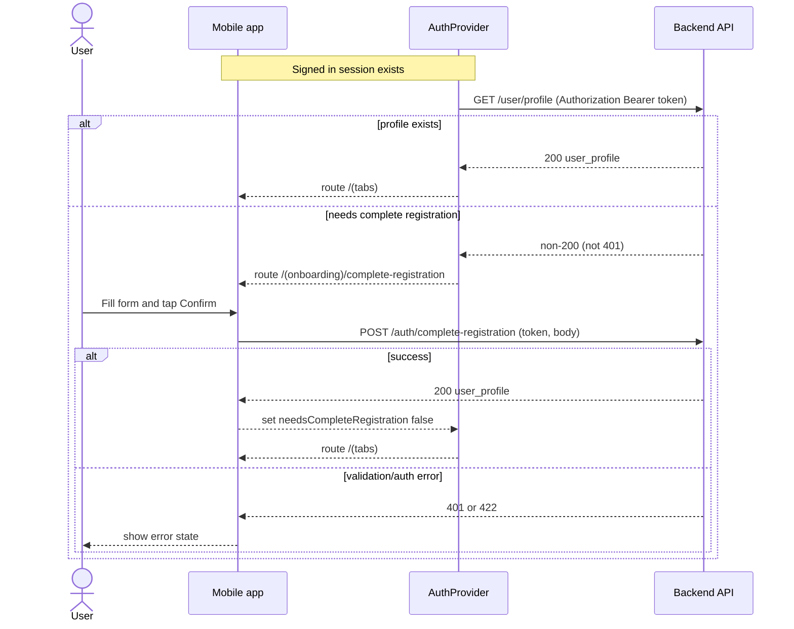

# Design Document

## Overview

Цель: добавить шаг дорегистрации после регистрации/входа, чтобы пользователь заполнил профиль (name, surname, birthdate, avatar) до попадания в основное приложение.

Дорегистрация завершается вызовом API `POST /auth/complete-registration` (token required) и успешным ответом `200 OK` с `user_profile`.

## Key Findings (from existing repo + api_requests_structure.md)

- Навигационный “гейтинг” сейчас живёт в `AuthProvider` и переключает группы роутов Expo Router между `/(auth)` и `/(tabs)`.
- В repo уже есть UI паттерны для форм (например `AuthInput`, `AuthButton`) и для аватара (`UserProfileCard` на Tamagui `Avatar`).
- В API-контракте есть:
  - `POST /auth/complete-registration` (token required) → `200 user_profile`, `401`, `422`.
  - `GET /user/profile` (token required) → `200 user_profile`, `401`.

## Architecture

### Current

- `AuthProvider` держит `user`/`session` из Supabase.
- Роутинг:
  - если `!user` → `/(auth)/welcome`
  - если `user` → `/(tabs)`

### Proposed

Добавить промежуточную ветку `/(onboarding)` для дорегистрации.

- `AuthProvider` будет определять состояние `needsCompleteRegistration`.
- Если `user` существует и `needsCompleteRegistration === true`, то пользователь попадает на `/(onboarding)/complete-registration`.

```mermaid
%% Architecture overview (current vs proposed)
flowchart TD
  A["App start"] --> B["AuthProvider loads session"]
  B --> C{ "user exists" }
  C -- "No" --> D["Route to /(auth)"]
  C -- "Yes" --> E["Check profile status"]
  E --> F{ "needsCompleteRegistration" }
  F -- "Yes" --> G["Route to /(onboarding)/complete-registration"]
  F -- "No" --> H["Route to /(tabs)"]

  subgraph API["Backend API"]
    API1["GET /user/profile"]
    API2["POST /auth/complete-registration"]
  end

  E -. "uses token" .-> API1
  G -. "Confirm" .-> API2
```

## Components and Interfaces

### New screens/routes

- NEW: `app/(onboarding)/_layout.tsx`
  - Stack layout для onboarding.
- NEW: `app/(onboarding)/complete-registration.tsx`
  - Форма: `name`, `surname`, `birthdate`, `avatar`.
  - Confirm вызывает `authApi.completeRegistration(...)`.

### Auth context changes

- Modify: `contexts/AuthContext.tsx`
  - Добавить состояние `needsCompleteRegistration` и `profileLoading`.
  - При наличии `session.access_token` выполнять загрузку профиля (через API слой) и решать, куда роутить.

### API layer

- Modify: `services/api.ts`
  - Добавить `authApi.completeRegistration(token, payload)`.
  - Добавить `profileApi.getProfile(token)` (или расширить существующий `userApi` отдельным методом `getProfile`).

## Data Models

### New types (proposal)

- NEW: `types/user-profile.ts` (или расширение `types/index.ts`)

```ts
// new
export type UserProfile = {
  id: string;
  externalUuid: string;
  email: string;
  name: string;
  surname: string;
  registrationDate: string;
  birthdate: string;
  avatar: string;
  completedCourses: number;
  inProgressCourses: number;
  streak: number;
};

// new
export type CompleteRegistrationRequest = {
  name: string;
  surname: string;
  birthdate: string; // YYYY-MM-DD
  avatar: string;
};
```

### Mapping snake_case → camelCase

API возвращает `user_profile` в snake_case; клиент хранит в camelCase. Маппинг должен жить в `services/api.ts`, чтобы UI не работал с snake_case.

## Profile status detection

Чтобы выполнить Requirement 1.2 (“при открытии приложения… если дорегистрация не завершена”), нужно надёжно понять, завершена ли дорегистрация.

Предлагаемая логика:

- `GET /user/profile` с токеном.
- Если `200 OK`, то дорегистрация считается завершённой.
- Если `401 Unauthorized`, показываем ошибку авторизации и предлагаем повторить вход.
- Любая другая ошибка загрузки профиля трактуется как “не можем определить статус” и должна показывать блокирующее состояние с Retry (без перехода в `/(tabs)`), чтобы не пускать пользователя “мимо” дорегистрации.

## UI / GUI Design Changes

### Screen layout (Complete registration)

Форма — в стиле текущих auth-экранов (SafeArea + ScrollView + `AuthInput` + primary `AuthButton`).

- Поля:
  - Full Name (name)
  - Surname (surname)
  - Birthdate (YYYY-MM-DD)
  - Avatar (URL)
- Предпросмотр аватара: `Avatar.Image src={avatar}` + fallback инициалы.
- Confirm disabled пока поля невалидны.



### Prefill rules

- Если `user.user_metadata.full_name` есть:
  - заполнить `name`/`surname` из `full_name` (split по пробелу: первый токен → `name`, остальное → `surname`).
- Если `user.user_metadata.avatar_url` есть:
  - заполнить `avatar` этим URL.
- Пользователь может отредактировать любые предзаполненные значения.

## Error Handling

- `401` на `POST /auth/complete-registration`:
  - показать error toast/inline message “Session expired, please sign in again”
  - выполнить signOut и вернуть в `/(auth)`.
- `422`:
  - показать сообщение валидации (общим текстом) и подсветить форму как invalid.
- Network/unknown:
  - показать retry UI (не переводить пользователя в `/(tabs)`).

## Testing Strategy

- Unit tests:
  - Валидация `birthdate` формата `YYYY-MM-DD`.
  - Валидация обязательных полей и disabled состояния Confirm.
  - Маппинг `user_profile` snake_case → camelCase.
- Integration tests:
  - “Signed in, profile missing → routes to onboarding”.
  - “Complete registration success → routes to tabs”.

(Выбор конкретного test runner/инфры зависит от уже настроенных тестов в repo.)

## Current Architecture Analysis

Existing Code References:

- app/(auth)/register.tsx — Registration screen, collects `full_name` + email/password; will be modified (post-signup routing should not jump into tabs automatically).
- app/(auth)/login.tsx — Login screen; read-only.
- app/(auth)/welcome.tsx — Entry screen; read-only.
- app/(tabs)/\_layout.tsx — Tabs group; read-only.
- app/\_layout.tsx — Root layout; read-only.
- contexts/AuthContext.tsx — Central auth + routing gate; will be modified.
- app/settings/profile.tsx — Current profile display; read-only.
- app/(tabs)/settings.tsx + components/user/user-profile-card.tsx — Shows `avatar_url` from `user.user_metadata`; read-only.
- services/api.ts — Central API layer; will be modified.
- types/index.ts — Shared types; will be modified OR new types file added.

## Proposed Architecture Changes (deltas)

- Add a new route group `/(onboarding)` with a single screen `complete-registration`.
- Extend `AuthProvider` routing decision tree to include onboarding gate.
- Add API-layer functions:
  - `profileApi.getProfile(token)` for `GET /user/profile`.
  - `authApi.completeRegistration(token, payload)` for `POST /auth/complete-registration`.

Example (AuthContext routing decision):

```ts
// new
const inAuthGroup = rootSegment === "(auth)";
const inOnboardingGroup = rootSegment === "(onboarding)";

if (!user && !inAuthGroup) {
  router.replace("/(auth)/welcome");
  return;
}

if (user && needsCompleteRegistration && !inOnboardingGroup) {
  router.replace("/(onboarding)/complete-registration");
  return;
}

if (user && !needsCompleteRegistration && (inAuthGroup || inOnboardingGroup)) {
  router.replace("/(tabs)");
}
```

## Implementation Sequence

1. Add `/(onboarding)` route group and screen UI.
2. Add API-layer stubs and types for `UserProfile` + request payload.
3. Update `AuthProvider` to compute `needsCompleteRegistration` and route accordingly.
4. Wire prefill from Supabase user metadata for Google OAuth.
5. Add validation + error states + notifications.
6. Add minimal tests for validation + mapping.

## Migration Strategy

- Existing users (уже заходившие ранее):
  - При первом запуске после релиза будет выполнена проверка профиля.
  - Если профиль на backend уже существует → сразу в `/(tabs)`.
  - Если профиль отсутствует → пользователь проходит дорегистрацию один раз.

## Performance Considerations

- Проверка профиля выполняется один раз на событие изменения сессии (login/refresh) и кэшируется в состоянии контекста.
- UI формы использует простые controlled inputs; нагрузка минимальна.

## Security Considerations

- Токен используется только для запросов к backend и не сохраняется в AsyncStorage вручную.
- В продакшене нельзя логировать `access_token`.
- Ошибки должны быть user-friendly и не раскрывать чувствительные детали.

## Maintenance Considerations

- Вся работа с API (headers, маппинг, ошибки) сосредоточена в `services/api.ts`.
- UI экрана дорегистрации переиспользует существующие компоненты (`AuthInput`, `AuthButton`, Tamagui `Avatar`).

## Traceability

| Requirement | Design coverage                                                         |
| ----------- | ----------------------------------------------------------------------- |
| R1          | Architecture → Proposed; Auth context changes; Profile status detection |
| R2          | UI / GUI Design Changes; Prefill rules; Components and Interfaces       |
| R3          | API layer; Error Handling; Sequence diagram                             |
| R4          | Error Handling; UI validation; Testing Strategy                         |


