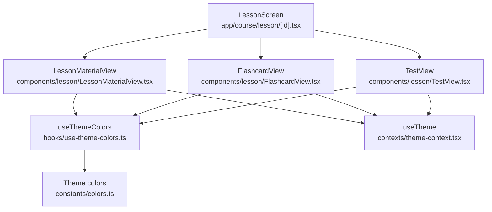
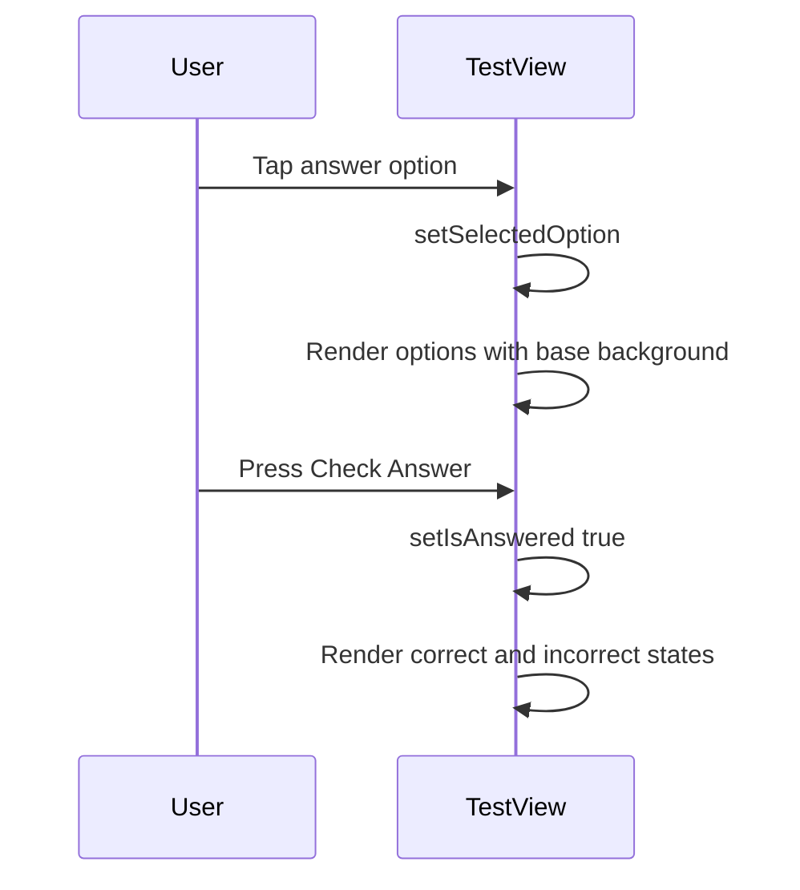

# Design Document

## Overview

Дизайн-изменения затрагивают три части экрана урока:

- Материал урока: каждый блок материала отображается внутри отдельной карточки.
- Flashcards: фон карточки становится визуально более отделённым от фона экрана в тёмной теме.
- Вопросы: каждый вариант ответа получает собственную подложку, отличимую от фона карточки вопроса даже без выбора.

Цель — улучшить визуальную иерархию и читабельность без добавления новых экранов, новых сценариев или изменения логики.

## Current Architecture Analysis

Текущий экран урока построен вокруг трёх фаз и рендера соответствующего компонента:

- `app/course/lesson/[id].tsx`: переключает `phase` между `material`, `flashcards`, `test` и отображает:
  - `components/lesson/LessonMaterialView.tsx`
  - `components/lesson/FlashcardView.tsx`
  - `components/lesson/TestView.tsx`
- Цвета/темизация:
  - `hooks/use-theme-colors.ts`
  - `constants/colors.ts` (включая `background` и `cardBackground`)
  - `contexts/theme-context.tsx` (даёт `activeTheme`)

Наблюдения по текущему UI:

- `LessonMaterialView` выводит `materials.map(...)` и рендерит Markdown, но без визуального контейнера-карточки вокруг каждого блока.
- `FlashcardView` использует `colors.cardBackground` для фона обеих сторон карточки.
- `TestView` использует `colors.cardBackground` как фон карточки вопроса, а для опций по умолчанию тоже возвращает `$gray3`, из-за чего варианты ответа визуально сливаются с карточкой вопроса.

## Architecture

Ниже — логическая архитектура рендера урока и зависимости по темам.



## Proposed Architecture Changes

Изменения остаются в рамках существующих компонентов и затрагивают только UI-слои:

- `LessonMaterialView`: оборачивает каждый `material` в Tamagui-карточку (`YStack` с `backgroundColor`, `padding`, `borderRadius`, `borderColor`).
- `FlashcardView`: вычисляет фон flashcard на основе `activeTheme` (тёмная тема — более «приподнятая» подложка по токенам), не меняя глобально `constants/colors.ts`.
- `TestView`: разделяет фон карточки вопроса и фон каждого ответа, используя базовый фон ответа, отличный от `colors.cardBackground`.

Новые компоненты не добавляются.

## Components and Interfaces

### LessonMaterialView

- Вход: `materials: LessonMaterial[]` (как сейчас)
- Изменение: добавляется «card wrapper» вокруг Markdown для каждого `material`.

Минимальный фрагмент изменения (концептуально):

```tsx
// existing
{
  materials.map((material) => (
    <YStack
      key={material.id}
      marginBottom="$4"
      backgroundColor={colors.cardBackground}
      padding="$4"
      borderRadius="$6"
      borderWidth={1}
      borderColor="$gray4"
    >
      <Markdown style={markdownStyles as any}>{material.content}</Markdown>
    </YStack>
  ));
}
```

### FlashcardView

- Вход: `cards: Flashcard[]` (как сейчас)
- Изменение: фон flashcard вычисляется из темы и токенов.

Идея: использовать `useTheme()` чтобы понимать `activeTheme` и выбрать более контрастную подложку в тёмной теме.

```tsx
// new
import { useTheme } from "@/contexts/theme-context";

// new
const { activeTheme } = useTheme();
const flashcardBackground =
  activeTheme === "dark" ? "$gray4" : colors.cardBackground;
```

Дальше `flashcardBackground` используется как `backgroundColor` обеих сторон карточки.

### TestView

- Вход: `questions: TestQuestion[]` (как сейчас)
- Изменение: базовый фон ответа отличается от фона карточки вопроса.

Принцип:

- `QuestionCard` остаётся на `colors.cardBackground`.
- Опции по умолчанию (не выбранные и не проверенные) получают фон `colors.background` (или другой токен, который визуально читается как «вставка»), плюс лёгкую рамку.

```tsx
// new
const { activeTheme } = useTheme();

// new
const baseOptionBackground = colors.background; // token

// new
const getOptionBackgroundColor = (index: number) => {
  if (!isAnswered) {
    return selectedOption === index ? "$blue3" : baseOptionBackground;
  }
  if (index === currentQuestion.correctAnswer) return "$green3";
  if (selectedOption === index) return "$red3";
  return baseOptionBackground;
};
```

## Data Models

Структуры данных не меняются:

- `LessonMaterial` используется для `materials`.
- `Flashcard` используется для `cards`.
- `TestQuestion` используется для `questions`.

## GUI Design Changes

### Экран материала

- Каждый `material` выглядит как отдельная карточка внутри списка.
- Отступы: список сохраняет внешний padding как сейчас, карточки разделяются `marginBottom`.

ASCII-эскиз:

```
[Header]
Title
Course title

[Card]
Markdown content...

[Card]
Markdown content...

[Primary button: Next]
```

### Экран flashcards

- Карточка визуально выделяется на фоне экрана в тёмной теме за счёт более контрастного `backgroundColor`.

### Экран вопросов

- Карточка вопроса (внешняя) и каждый ответ (внутренний) имеют разный фон.
- Даже без выбора каждый ответ выглядит как отдельная «плашка».

ASCII-эскиз:

```
[Question card]
Question text

  [Answer row background]
  Answer A

  [Answer row background]
  Answer B

  [Answer row background]
  Answer C

[Button: Check Answer]
```

## Error Handling

Ошибки не добавляются и логика не меняется. Потенциальные UI-граничные случаи:

- Пустые `materials`: карточки не рендерятся (см. R1.AC4).
- Отсутствующие `options` у вопроса: текущий код уже использует `options?.map(...)`.

## Performance Considerations

- Карточки добавляют несколько контейнеров `YStack`, что незначительно влияет на layout.
- Изменения не добавляют сетевых запросов и не меняют состояние.

## Security Considerations

- Изменения только визуальные. Новых источников данных, пермишенов и хранения не добавляется.

## Maintenance Considerations

- Стиль карточек для материала и ответов использует существующие theme tokens (`colors.background`, `colors.cardBackground`, `$gray4`).
- Все изменения локализованы в существующих UI-компонентах урока.

## Testing Strategy

Автотесты в репозитории для этих экранов не обнаружены в виде отдельной папки/конфига тест-раннера.

Рекомендуемая стратегия (для последующего плана задач):

- Добавить минимальные unit/UI-тесты рендера:
  - `LessonMaterialView`: рендерит N карточек по количеству материалов и не рендерит пустые.
  - `TestView`: опции имеют фон отличный от карточки вопроса в состоянии «не выбрано».
  - `FlashcardView`: фон карточки отличается от фона экрана в тёмной теме (проверка через токены/props).

## Implementation Sequence

1. Изменить `LessonMaterialView`: обернуть каждый материал в карточку.
2. Изменить `FlashcardView`: добавить `useTheme()` и выбрать более контрастный токен для фона в тёмной теме.
3. Изменить `TestView`: разделить фон карточки вопроса и фон каждого ответа.
4. Добавить/обновить минимальные тесты (если будет принято решение вводить тест-раннер).

## Migration Strategy

- Миграция не требуется.
- Изменения обратимы и не меняют данные.

## Traceability

| Requirement | Design coverage                                                                   |
| ----------- | --------------------------------------------------------------------------------- |
| R1          | `LessonMaterialView` card wrapper + GUI section "Экран материала"                 |
| R2          | `FlashcardView` `flashcardBackground` на основе `activeTheme`                     |
| R3          | `TestView` `baseOptionBackground` и обновлённая логика `getOptionBackgroundColor` |

## Existing Code References

- `app/course/lesson/[id].tsx` — экран урока и переключение фаз (read-only)
- `components/lesson/LessonMaterialView.tsx` — рендер материалов (will be modified)
- `components/lesson/FlashcardView.tsx` — рендер flashcards (will be modified)
- `components/lesson/TestView.tsx` — рендер вопросов и опций (will be modified)
- `hooks/use-theme-colors.ts` — выбор темы в `ThemeColors` (read-only)
- `constants/colors.ts` — токены цветов и `cardBackground` (read-only)
- `contexts/theme-context.tsx` — `activeTheme` (read-only)

## Open Verifications

- Нет.


