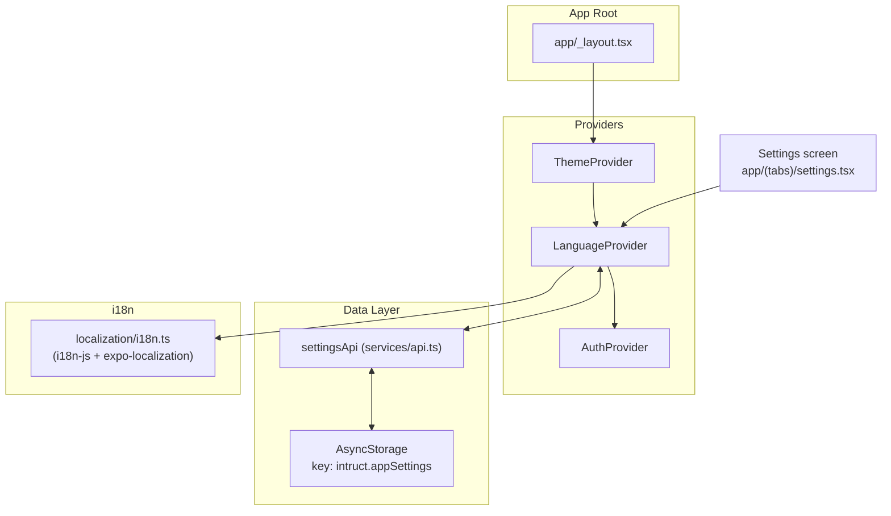
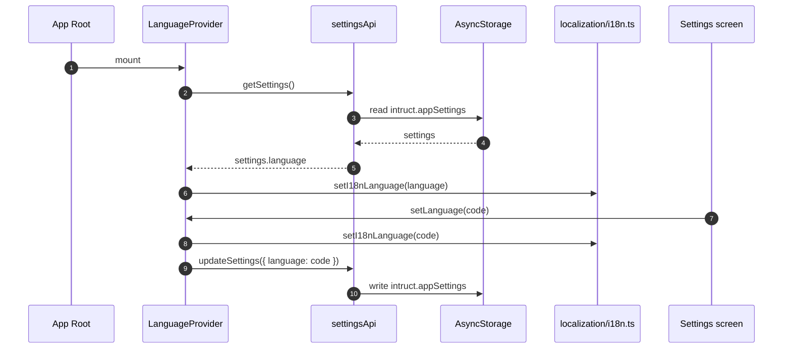
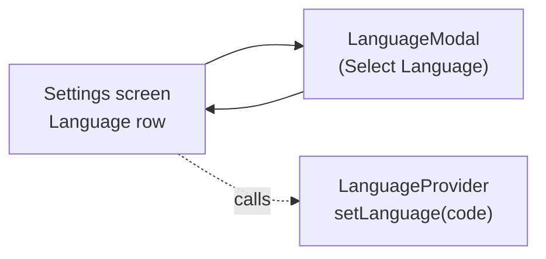

# Design Document

## Overview

Цель: добавить инфраструктуру “выбранный язык приложения” как глобальное состояние (provider + hook) и подготовить i18n-слой (expo-localization + i18n-js), не выполняя локализацию экранов и строк на этом этапе.

Ключевая идея: переиспользовать существующую модель настроек приложения (`AppSettings.language`) и существующий механизм сохранения настроек (`settingsApi` в `services/api.ts`), а поверх него дать удобный `LanguageProvider`. Отдельно подготовить `i18n`-инстанс и `t()` функцию, но пока не использовать их в UI.

## Current Architecture Analysis

### Existing Code References

- app/\_layout.tsx

  - Назначение: корневой layout Expo Router, подключение текущих providers (`ThemeProvider`, `AuthProvider`, `NotificationsProvider`, `CourseGenerationProvider`).
  - Impact: will be modified (подключить новый `LanguageProvider`).

- contexts/theme-context.tsx

  - Назначение: пример паттерна provider + AsyncStorage + `useTheme()`.
  - Impact: read-only (использовать как ориентир структуры provider/hook).

- services/api.ts

  - Назначение: единый слой данных/моков; включает `settingsApi` и хранение `AppSettings` в AsyncStorage (`SETTINGS_STORAGE_KEY = "intruct.appSettings"`).
  - Impact: likely modified (минимально: добавить безопасные хелперы/экспорт для чтения/записи языка через `settingsApi`, либо использовать `settingsApi` напрямую в provider).

- types/index.ts

  - Назначение: типы, включая `AppSettings` с полем `language: string`.
  - Impact: read-only (возможна точечная типизация языка позже).

- app/(tabs)/settings.tsx

  - Назначение: экран Settings; содержит UI для “Language” (App Settings) и использует `settingsApi.getSettings()` / `settingsApi.updateSettings({ language })`.
  - Impact: will be modified (вместо локального `uiLanguage` использовать язык из provider и менять язык через provider).

- components/modals/language-modal.tsx

  - Назначение: bottom-sheet модалка выбора языка, отдаёт выбранный `value` через `onValueChange`.
  - Impact: read-only (использовать без изменений).

- mockdata/settings.ts
  - Назначение: список `languageOptions` (code/label/flag) для UI выбора.
  - Impact: read-only.

### Observations

- В проекте уже есть понятие UI языка (Settings → App Settings → Language), и оно сохраняется через `settingsApi` в `AsyncStorage`.
- Сейчас отсутствует единый app-wide provider для языка (по найденным вхождениям), поэтому остальные экраны не имеют стандартного способа узнать/изменить язык.
- В проекте пока не обнаружено i18n-слоя (например, `t()`/словарей переводов), поэтому его нужно добавить как инфраструктуру.

## Proposed Architecture Changes

### New provider

Добавить `LanguageProvider` и `useLanguage()`:

- Источник истины: `language` в `AppSettings`.
- Инициализация: при старте provider читает `settingsApi.getSettings()` и устанавливает `language`.
- Изменение: `setLanguage(next)` обновляет локальный state и вызывает `settingsApi.updateSettings({ language: next })`.
- Provider хранит `isLoaded` (или аналог) чтобы корневой layout мог подождать загрузку языка (или provider возвращал `null` пока не загружен — как в `ThemeProvider`).

Предлагаемые файлы (NEW):

- contexts/language-context.tsx (NEW)

  - `LanguageProvider`
  - `useLanguage()`
  - `SUPPORTED_UI_LANGUAGES` (получать из `languageOptions` или держать рядом как минимальную константу)

- localization/i18n.ts (NEW)

  - Создаёт `i18n` (из `i18n-js`), включает fallback.
  - Экспортирует `t(key, params?)` и `setI18nLanguage(languageCode)`.
  - По умолчанию выставляет язык по сохранённому значению из `LanguageProvider`; если сохранённого нет — берёт язык устройства через `expo-localization` (`getLocales()[0].languageCode ?? "en"`).

- localization/translations.ts (NEW)
  - Словари переводов (на старте могут быть пустыми или содержать минимум служебных ключей).

### Wiring

- app/\_layout.tsx

  - Обернуть существующие провайдеры в `LanguageProvider` (порядок: язык не зависит от auth, можно ставить рядом с `ThemeProvider`).

- app/(tabs)/settings.tsx
  - Читать `language` из provider, а не держать отдельный `uiLanguage` state.
  - При выборе языка: вызывать `setLanguage(languageCode)` из provider.
  - (Опционально) оставить запись в `settingsApi.updateSettings` внутри provider, чтобы SettingsScreen не знала о storage.

### Optional future integration (not in this scope)

- Локализация метаданных приложения (Expo `locales` в `app.json`) — отдельный шаг.
- Массовая замена строк экранов на `t()` и организация переводов по доменам — отдельный шаг.

## Architecture



## Runtime Flow



## Components and Interfaces

### `LanguageProvider` (NEW)

Responsibilities:

- Хранить `language` и статус загрузки.
- Давать `setLanguage()` для изменения языка.
- Синхронизировать язык с i18n-слоем (выставлять `i18n.locale`).

Public interface (пример, минимальный):

```ts
// new
export type UiLanguageCode = string;

export type LanguageContextValue = {
  language: UiLanguageCode;
  isLoaded: boolean;
  setLanguage: (next: UiLanguageCode) => Promise<void>;
};
```

### `useLanguage()` (NEW)

- Возвращает `LanguageContextValue`.
- Fail-fast если хук вызывается вне provider.

## Data Models

- Используем существующий `AppSettings.language: string` (types/index.ts).
- Storage: через существующий ключ `SETTINGS_STORAGE_KEY = "intruct.appSettings"` внутри `services/api.ts`.
- i18n: словари в `localization/translations.ts`.

## Error Handling

- Ошибка чтения настроек:

  - Provider устанавливает язык по умолчанию (например, `"en"`) и помечает `isLoaded=true`.
  - Ошибка логируется через `console.error` (как в `contexts/theme-context.tsx`).

- Ошибка чтения локали устройства:

  - Использовать `"en"` как fallback.

- Ошибка записи языка:

  - Provider оставляет локально выбранный язык, но логирует ошибку.

- Некорректный язык:
  - Provider валидирует `next` по допустимому списку (минимально: проверка наличия в `languageOptions`), иначе падает обратно на default.

## GUI Design Changes

Визуально ничего не меняем.

- Settings → App Settings → Language
  - UI остаётся тем же (используется существующий `LanguageModal`).
  - Меняется только wiring: значение берётся из `LanguageProvider`, а изменения идут через `setLanguage()`.

GUI sketch (без добавления новых экранов):



Accessibility notes:

- Новые элементы управления не добавляются.
- Смена языка остаётся через существующий список опций; provider не влияет на a11y напрямую.

Empty/error states:

- Если provider ещё не загрузился: Settings может временно показывать fallback label (например, English) либо ждать загрузки — решение фиксируется в implementation tasks.

## Implementation Sequence

1. Добавить `localization/i18n.ts` + `localization/translations.ts` (NEW) и зависимости (`expo-localization`, `i18n-js`).
2. Добавить `contexts/language-context.tsx` (NEW) с provider/hook и интеграцией с `settingsApi` + синхронизацией i18n.
3. Подключить `LanguageProvider` в `app/_layout.tsx`.
4. Переподключить Settings screen, чтобы “App Language” читался/менялся через provider.
5. Добавить документацию в `docs/` о том, как дальше локализовывать экраны и как использовать `t()`.

## Testing Strategy

В репозитории не обнаружен явный тест-раннер в `package.json` scripts (только `lint`). Поэтому стратегия на минимальный этап:

- Добавить простые unit-тесты только если тестовая инфраструктура уже есть/будет добавлена отдельной задачей.
- Иначе: ограничиться TypeScript проверкой и ручной проверкой wiring (после реализации).

## Migration Strategy

- Значение языка уже хранится как `AppSettings.language`.
- Новый provider читает то же поле и не требует миграции данных.
- Default остаётся `"en"`, если настройки отсутствуют/повреждены.

## Performance Considerations

- Provider грузит настройки один раз при старте (через `settingsApi.getSettings()`), что уже используется в SettingsScreen.
- `setLanguage()` — редкая операция; запись в AsyncStorage best-effort.

## Security Considerations

- Язык не является чувствительными данными.
- Хранение в AsyncStorage допустимо.

## Maintenance Considerations

- Provider даёт единый контракт для будущей локализации.
- `t()` и словари добавлены как инфраструктура и могут внедряться в UI постепенно.

## Traceability

| Requirement | Design coverage                                                                         |
| ----------- | --------------------------------------------------------------------------------------- |
| R1          | Current Architecture Analysis, Proposed Architecture Changes, Components and Interfaces |
| R2          | Components and Interfaces, Error Handling                                               |
| R3          | Architecture, Wiring, Components and Interfaces                                         |
| R4          | GUI Design Changes, Proposed Architecture Changes                                       |
| R5          | Maintenance Considerations, Implementation Sequence                                     |

## Risks & Mitigations

1. Риск: дублирование источников языка (Settings хранит одно, provider — другое).

   - Mitigation: provider использует `settingsApi` как источник истины и Settings вызывает только provider.

2. Риск: некорректные/неподдерживаемые коды языка.

   - Mitigation: whitelist через список опций (`languageOptions`) + fallback.

3. Риск: будущий переводчик потребует дополнительные зависимости.

- Mitigation: зависимости добавляются сейчас, но UI не затрагивается; миграция строк делается поэтапно.
