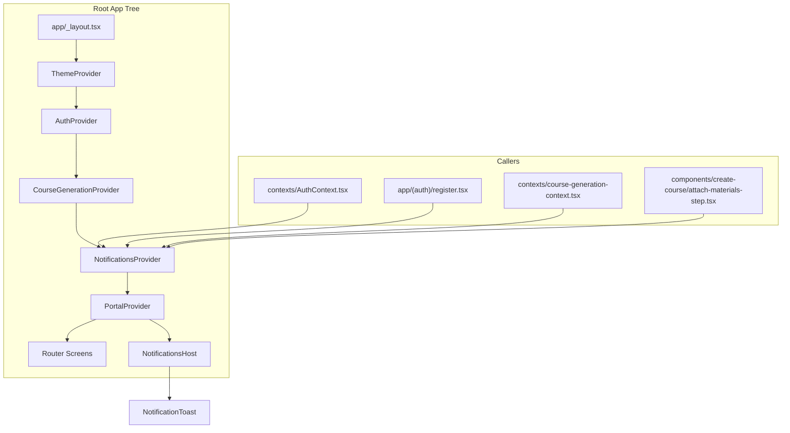

# Design Document

## Overview

Цель: добавить единый слой уведомлений (toast/snackbar-подобные) для всего приложения, чтобы показывать:

- успех авторизации/выхода,
- начало генерации курса,
- ошибки (валидация/сеть/неожиданное).

Решение: новый `NotificationsProvider` (React Context) + `NotificationsHost` (рендер поверх всего приложения через существующий `@tamagui/portal`), и настраиваемый UI-компонент уведомления.

Ключевой принцип: уведомления вызываются из экранов/контекстов/сервисов через хук (`useNotifications()`), без прямой зависимости от конкретного экрана.

## Current Architecture Analysis

### Existing Code References

- app/\_layout.tsx — корневой композиционный слой провайдеров (`ThemeProvider`, `AuthProvider`, `CourseGenerationProvider`), а также `PortalProvider` (read-only, will be modified).
- hooks/use-theme-colors.ts — текущая точка получения theme colors через `useThemeColors()` (read-only).
- docs/THEMING.md — правила использования цветов и токенов Tamagui (read-only).
- contexts/AuthContext.tsx — логика sign-in/sign-up/sign-out; сейчас использует `Alert.alert(...)` для ошибок/успеха (will be modified).
- app/(auth)/register.tsx — использует `Alert.alert(...)` для ошибок формы/регистрации (will be modified).
- components/create-course/attach-materials-step.tsx — использует `Alert.alert(...)` для ошибок выбора файлов (will be modified).
- contexts/course-generation-context.tsx — запускает генерацию курса и ловит ошибки (will be modified).
- app/create-course.tsx — вызывает `startCourseGeneration(...)` и делает navigation (read-only, likely no change needed).

## Architecture

### High-level structure

- `NotificationsProvider` хранит состояние одного активного уведомления и предоставляет API `notify(...)`, `dismiss(...)`.
- `NotificationsHost` подписывается на контекст и рендерит `NotificationToast` поверх приложения.
- Показ одновременно максимум 1 уведомления.
- Правило конкуренции: новое уведомление заменяет текущее (самое простое предсказуемое правило).

### Mermaid: architecture



## Components and Interfaces

### New files (planned)

- `contexts/NotificationsContext.tsx` (NEW)
  - Экспорт: `NotificationsProvider`, `useNotifications()`
  - API:
    - `notify(input)` → показывает уведомление
    - `dismiss(id?)` → скрывает текущее уведомление
- `components/notifications/NotificationToast.tsx` (NEW)
  - Презентационный компонент
- `components/notifications/NotificationsHost.tsx` (NEW)
  - Подключается к контексту и рендерит toast через portal/absolute overlay

### Public API design (TypeScript)

- `NotificationType`:
  - `"success" | "info" | "error"`
- `NotificationAction`:
  - `label: string`
  - `onPress: () => void`
- `NotifyInput`:
  - `type: NotificationType`
  - `title?: string`
  - `message: string`
  - `durationMs?: number` (если не задано — дефолт 2500–4000ms в реализации)
  - `action?: NotificationAction`
  - `dismissible?: boolean` (дефолт true)

Provider должен гарантировать:

- чистку таймеров при замене/скрытии,
- отсутствие утечек при unmount.

## Data Models

Внутреннее состояние провайдера:

- `active: { id: string; input: NotifyInput; createdAt: number } | null`
- `timeoutHandle: ReturnType<typeof setTimeout> | null`

ID генерируется локально (например `${Date.now()}_${Math.random()}`), без зависимости от внешних библиотек.

## GUI Design Changes

### Placement

- Уведомление появляется поверх контента, без блокировки взаимодействия со screen.
- Позиция по умолчанию: верх (top) с учётом safe-area, либо низ — но выбрать один вариант и использовать везде (предпочтительно top, чтобы не пересекаться с нижними табами).

### UI sketch (ASCII)

```
┌──────────────────────────────────────────┐
│  [Title optional]                 [×]    │
│  message text…                           │
│  [Action optional]                       │
└──────────────────────────────────────────┘
```

### Controls list

- Close button
  - role: button
  - icon: "X" (или tamagui/lucide icon)
  - accessibilityLabel: "Dismiss notification"
- Action button (optional)
  - role: button
  - text: `action.label`
  - accessibilityLabel: `action.label`

### States

- Default: visible
- Dismissed: hidden
- Auto-dismiss: hidden after `durationMs`
- Error: визуально отличается (фон/акцент)

### Theming

- Использовать `useThemeColors()` для базовых поверхностей/текста.
- Для типа:
  - success: можно опираться на `colors.stats.completed.*`
  - info: можно опираться на `colors.primary`/`colors.cardBackground`
  - error: использовать tamagui token `$red9`/`$red10` (без hex)

## Error Handling

- Provider не должен выбрасывать ошибки в UI.
- Для error-уведомлений:
  - показывать безопасное сообщение (без сырых stack traces и токенов).
- Интеграция:
  - заменить `Alert.alert(...)` на `notify({ type: "error", ... })` там, где сейчас показываются ошибки.

## Proposed Architecture Changes

### Wiring

- В app/\_layout.tsx добавить `NotificationsProvider` и `NotificationsHost` так, чтобы toast мог рендериться поверх любых экранов.
  - Provider логически рядом с `AuthProvider`/`CourseGenerationProvider`.
  - Host внутри `PortalProvider` (чтобы гарантированно быть поверх).

### Call sites

- contexts/AuthContext.tsx
  - success: после успешного sign-in / sign-out → success уведомление.
  - errors: вместо `Alert.alert("Login Error", ...)` → error уведомление.
- app/(auth)/register.tsx
  - ошибки валидации/регистрации → error уведомление.
- contexts/course-generation-context.tsx
  - при старте генерации → info уведомление.
  - при ошибке createCourse → error уведомление.
- components/create-course/attach-materials-step.tsx
  - ошибка file picker → error уведомление.

## Implementation Sequence

1. Добавить новый `NotificationsProvider` + базовый API (`notify`, `dismiss`).
2. Добавить `NotificationToast` UI-компонент (Tamagui), покрыть accessibility.
3. Добавить `NotificationsHost` и подключить его в app/\_layout.tsx.
4. Перевести существующие `Alert.alert` в местах авторизации/регистрации/attach-materials на новый API.
5. Добавить уведомление "Создание курса началось" в course-generation flow.
6. Пройтись по catch-блокам и заменить немые `console.error` на user-facing error notification там, где это соответствует UX.
7. Прогнать `npm run lint` и TypeScript проверки.

## Testing Strategy

В проекте нет настроенного тест-раннера (в `package.json` нет `test`), поэтому на этом этапе опираемся на:

- `npm run lint` (expo lint)
- `npx tsc -p tsconfig.json --noEmit`
- ручная проверка критических сценариев:
  - login success/error
  - logout success/error
  - create course start
  - file picker failure

(Если позже понадобится автотестирование UI, тогда отдельно добавим тестовый стек — это отдельное решение и отдельно согласуется.)

## Migration Strategy

- Уведомления добавляются постепенно:
  - Сначала provider/host
  - Затем замена `Alert.alert` по одному месту за раз
- Фолбэк:
  - В случае отсутствия provider (ошибка интеграции) — `useNotifications()` должен выбрасывать понятную ошибку для разработчика (dev-only), чтобы быстро поймать неверный wiring.

## Performance Considerations

- Одновременно максимум 1 уведомление.
- Минимизировать ререндеры: хранить только `active` в состоянии; memoize callbacks.
- Таймеры чистить при смене уведомления и при unmount.

## Security Considerations

- Не показывать в уведомлениях:
  - токены,
  - email/PII,
  - raw stack traces.
- Для неожиданных ошибок — общий текст, а детали только в `console.error`.

## Maintenance Considerations

- Единый UI-компонент → единый стиль.
- Один API (`notify`) упрощает интеграцию в новые фичи.
- Типизация `NotifyInput` предотвращает разъезд параметров.

## Traceability

- R1 (Provider): Architecture, Components and Interfaces, Proposed Architecture Changes
- R2 (Component): GUI Design Changes, Components and Interfaces
- R3 (Auth success): Proposed Architecture Changes → AuthContext integration
- R4 (Course creation started): Proposed Architecture Changes → CourseGeneration integration
- R5 (Errors): Error Handling + Call sites
- R6 (Concurrency): Architecture (single active + replace rule)
