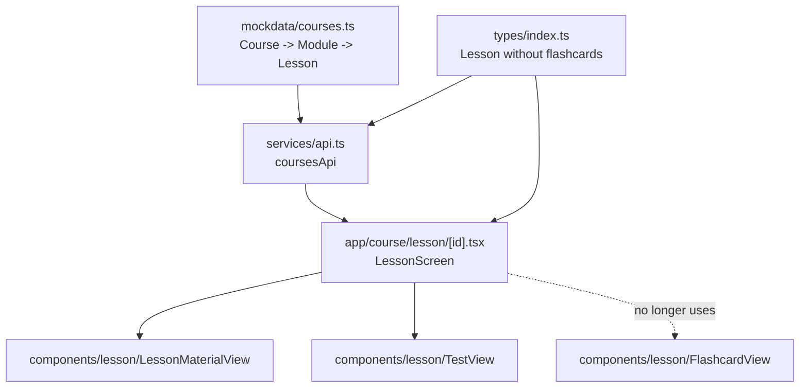
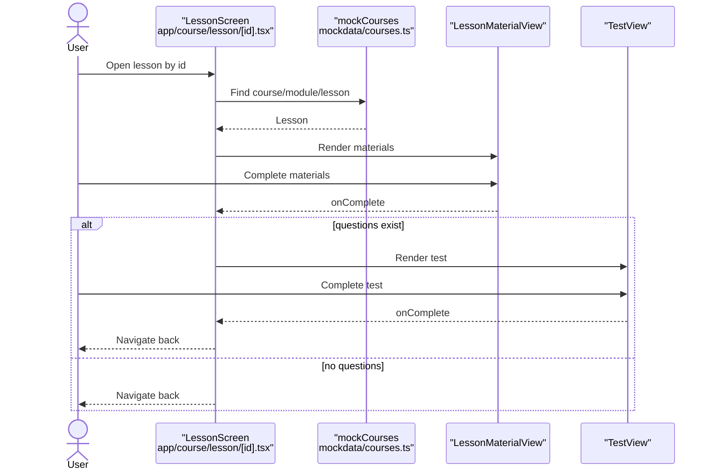

# Design Document

## Overview

Цель: полностью убрать «flash cards» как тип учебного контента из приложения.

В рамках изменения:

- Данные: удалить массивы `flashcards` из mockdata.
- Типы: убрать поле `Lesson.flashcards` и экспортируемый тип `Flashcard`.
- UI урока: убрать фазу/секцию `flashcards` из экрана урока и связанный прогресс/переходы.
- API слой: если в `services/api.ts` или соседних файлах найдутся flash-card методы — удалить (по текущему анализу их нет).
- Компонент `components/lesson/FlashcardView.tsx` должен остаться в репозитории, но он не должен быть подключён ни из одной активной навигационной ветки, и он не должен зависеть от удалённого экспортируемого типа.

## Current Architecture Analysis

### Existing Code References

- app/course/lesson/[id].tsx — экран урока, сейчас имеет фазы `material | flashcards | test`, импортирует `FlashcardView` и считает прогресс с учётом `lesson.flashcards`.
- components/lesson/FlashcardView.tsx — UI для просмотра карточек, импортирует `Flashcard` из `@/types`.
- types/index.ts — определяет `Lesson.flashcards?: Flashcard[]` и экспортирует интерфейс `Flashcard`.
- mockdata/courses.ts — содержит `flashcards: [...]` внутри уроков.
- components/create-course/review-step.tsx — текст в UI, где упоминаются “flashcards”.
- services/api.ts — API-обёртка над mockdata (прямых flash-card методов по текущему просмотру не видно).

### Current Data Flow

- `services/api.ts` отдаёт курсы из `mockdata/courses.ts`.
- Экран урока `app/course/lesson/[id].tsx` находит урок в `mockCourses` и рендерит одну из фаз.
- Типы из `types/index.ts` описывают структуру `Lesson` и, сейчас, включают `flashcards`.

## Proposed Architecture Changes

### Data model delta

- `Lesson` больше не содержит поля `flashcards`.
- Экспортируемый тип `Flashcard` удаляется.

Минимальный контракт урока останется: `materials?: LessonMaterial[]` и `questions?: TestQuestion[]`.

### UI flow delta

- Экран урока перестаёт иметь фазу `flashcards`.
- Переходы:
  - `material` → `test` (если есть вопросы) → завершение.
  - `material` → завершение (если теста нет).
- Прогресс-бар пересчитывается только по шагам `material` и `test`.

### Component containment

- `components/lesson/FlashcardView.tsx` остаётся как “unused component” (опционально), но:
  - он больше не импортирует `Flashcard` из `@/types`
  - его props используют локальный тип (не экспортируемый) либо inline-тип.

Пример допустимого изменения в компоненте (минимально и без экспорта типов):

```ts
// new
type FlashcardItem = {
  id: string;
  front: string;
  back: string;
};
```

## Architecture



## Components and Interfaces

### Lesson screen (changed)

- Удалить импорт `FlashcardView`.
- Удалить `LessonPhase = "material" | "flashcards" | "test"` → оставить только `"material" | "test"`.
- Удалить обработчик `handleFlashcardsComplete`.
- Упростить `renderContent()` (без ветки `flashcards`).
- Пересчитать `progressPercent` без `lesson.flashcards`.
- Упростить `nextLabel` в `LessonMaterialView` (без “Start Flashcards”).

### FlashcardView (must remain but must compile)

- Удалить зависимость от `import type { Flashcard } from "@/types"`.
- Использовать локальный тип `FlashcardItem`.

### Create-course review text (small UX cleanup)

- В `components/create-course/review-step.tsx` заменить текст, чтобы не упоминать “flashcards”. Это не функциональность, но пользовательский текст сейчас явно ссылается на удаляемый тип контента.

## Data Models

### Current

- `types/index.ts`:
  - `Lesson.flashcards?: Flashcard[]`
  - `export interface Flashcard { id; front; back }`

### Target

- `types/index.ts`:
  - `Lesson` без поля `flashcards`
  - нет экспортируемого `Flashcard`

## Error Handling

- Для runtime ошибок специальных обработчиков не требуется: это удаление функциональности.
- Основной “охранный механизм” — TypeScript: любые старые обращения к `lesson.flashcards` должны стать ошибками компиляции.

## Testing Strategy

- Типизация/сборка:
  - `code_checker` (TypeScript diagnostics).
- Линт:
  - `npm run lint` (в этом проекте запускает `expo lint`).
- Регрессии:
  - Проверить что экран урока рендерится для уроков с материалами и/или тестом.
  - Проверить что курс/урок загружается из `mockdata/courses.ts` после удаления полей.

(Новые тесты добавлять только если в проекте уже есть подходящая инфраструктура для тестов; иначе ограничиться линтом/тип-чеком.)

## GUI Design Changes

### Lesson screen layout (after)

Без секции карточек экран сохраняет текущую структуру:

```
[Header: lesson.title + courseTitle]
[Progress bar]
[Content]
  - Material view
  - Test view (if questions exist)
```

### Controls list

- Header back: стандартная кнопка назад (Expo Router header)
- Material view:
  - Next button (label без упоминания Flashcards)
- Test view:
  - Next/Submit по текущей реализации `TestView`

### Interaction states

- Default: material
- After material complete:
  - IF questions exist THEN переход в test
  - ELSE back

### Accessibility

- Никаких новых контролов не добавляется.
- Сохранить текущую семантику кнопок в `LessonMaterialView`/`TestView`.

### Empty/Error states

- Если урок не найден: текущий “Loading lesson…” экран остаётся без изменений.

## Implementation Sequence

1. Удалить `flashcards` из типов (`types/index.ts`) и зафиксировать ошибки компиляции в местах использования.
2. Удалить `flashcards` из `mockdata/courses.ts`.
3. Обновить `app/course/lesson/[id].tsx` (фазы, навигация, прогресс, `renderContent`).
4. Обновить `components/lesson/FlashcardView.tsx` чтобы он компилировался без `Flashcard` из `@/types` (оставить компонент неиспользуемым).
5. Убрать упоминание “flashcards” в `components/create-course/review-step.tsx`.
6. Прогнать `npm run lint` и убедиться, что TypeScript без ошибок.

## Migration Strategy

- Mockdata: удалить поля `flashcards` в каждом уроке.
- Типы: удаление поля/типа вызовет compile-time ошибки и заставит обновить потребителей.
- UI: убрать фазу `flashcards` — поведение урока останется последовательным (`material` → `test` → exit).

## Performance Considerations

- Упрощение экрана урока: меньше расчётов в `useMemo` (нет `flashcardsCount`).
- Меньше данных в mockdata → чуть меньше памяти при загрузке.

## Security Considerations

- Изменение не добавляет новые разрешения/данные.
- Не затрагивает хранение секретов.

## Maintenance Considerations

- Снижается сложность модели урока и экрана урока.
- Если `FlashcardView` остаётся, он становится “отсоединённым” и должен компилироваться автономно.

## Traceability

| Requirement | Design coverage                                                                                                                    |
| ----------- | ---------------------------------------------------------------------------------------------------------------------------------- |
| R1          | Current Architecture Analysis → mockdata/courses.ts; Proposed Architecture Changes → Data model delta; Implementation Sequence (2) |
| R2          | Data Models (Target); Proposed Architecture Changes → Data model delta; Implementation Sequence (1,4)                              |
| R3          | Components and Interfaces → Lesson screen; GUI Design Changes; Implementation Sequence (3)                                         |
| R4          | Current Architecture Analysis → services/api.ts; Implementation Sequence (6)                                                       |
| R5          | Proposed Architecture Changes → Component containment; Components and Interfaces → FlashcardView; Implementation Sequence (4)      |
| R6          | Testing Strategy; Implementation Sequence (6)                                                                                      |

## Risks & Mitigations

1. Риск: удаление `Flashcard` ломает `FlashcardView`.
   - Митигация: перевести компонент на локальный тип и убрать импорт из `@/types`.
2. Риск: уроки в mockdata могут стать “пустыми” (без test) и будут сразу завершаться.
   - Митигация: оставить существующие `materials` и `questions`; убедиться что каждый урок имеет хотя бы материалы.
3. Риск: остаются скрытые упоминания flashcards в тексте/UI.
   - Митигация: глобальный поиск по репо по `flash`/`flashcards` в рамках реализации и удаление упоминаний.


